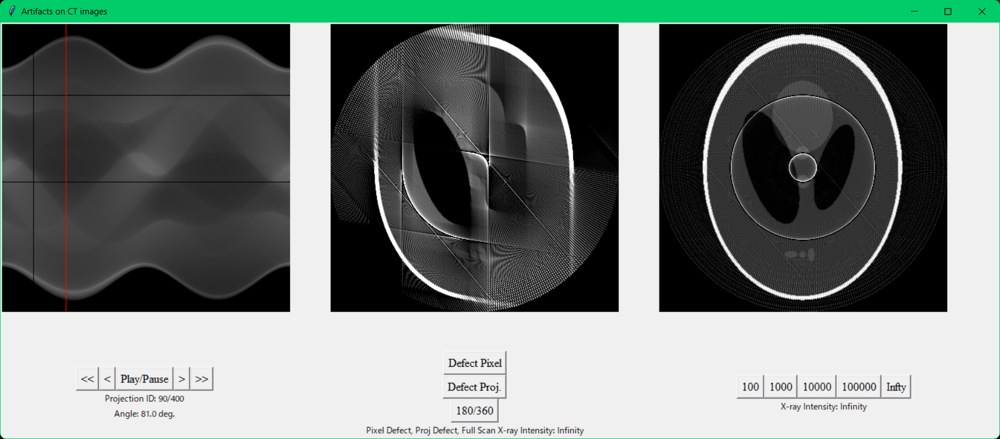

# demo-ct-artifacts

Generate animations of the image generation process of CT reconstruction that aid in the intuitive understanding of artifacts in CT reconstruction.

* Left: Sinogram
* Middle: WIP image
* Right: Reconstructed image
* Pixel defects, projection defects, noise, and scan angles can be switched.
